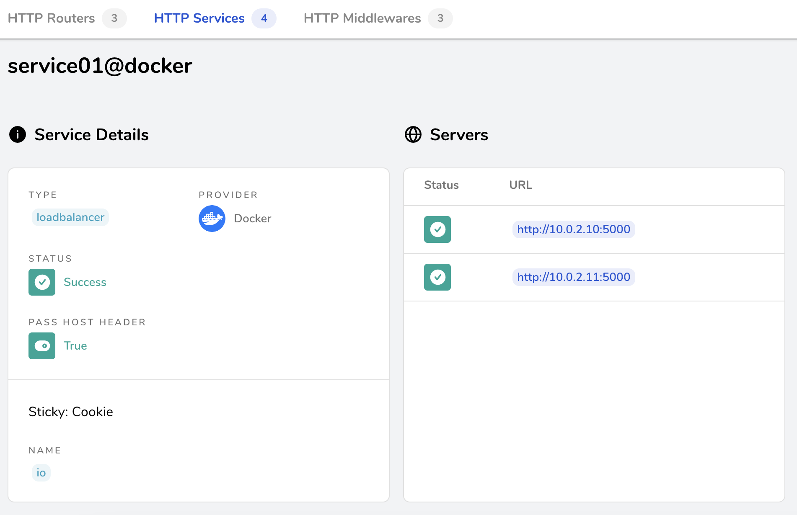
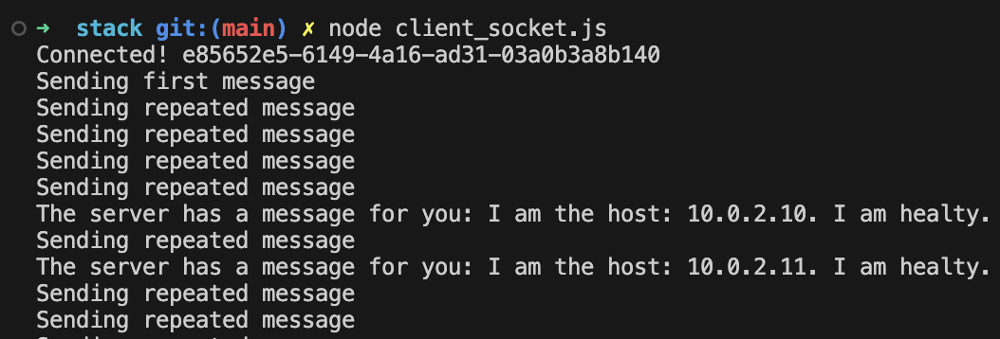
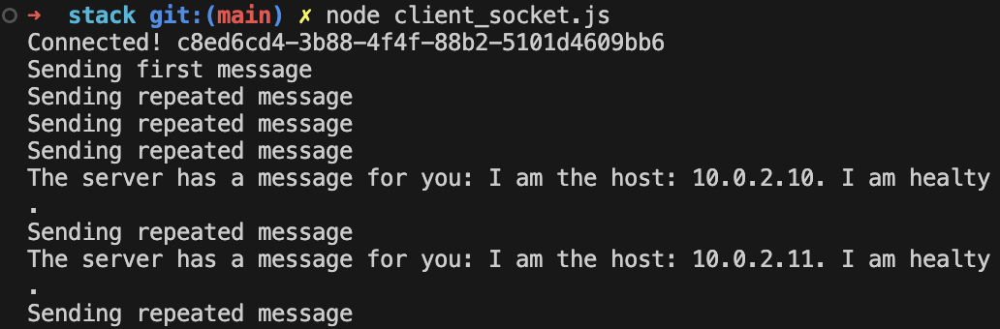
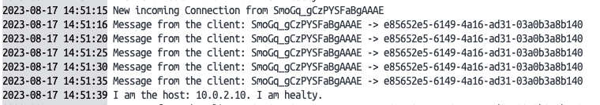
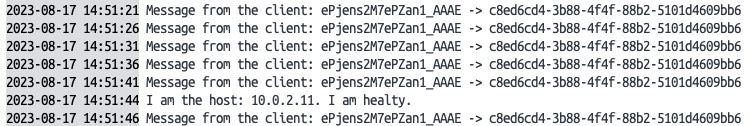

# Fundamentals

## Goals

Creating scalable clusters of Web Sockets to keep connections between many Clients and many Servers.

## Knowledge

### WebSockets

Websocket is a wide spread protocol allowing full-duplex communication over TCP. There are several libraries implementing that protocol, one of the most robust and well-known is `Socket.io` on the Javascript side, which allows to quickly create real-time communication patterns.

### Scale on WS

WebSockets differ from HTTP requests in the sense that they are persistent. The WebSocket client opens up a connection to the server and reuses it. On this long running connection, both the server and client can publish and respond to events. This concept is called a duplex connection. A connection can be opened through a load balancer, but once the connection is opened, it stays with the same server until it’s closed or interrupted.

This in turn means that the interaction is stateful; that you will end up storing at least some data in memory on the WebSocket server for each open client connection. For example, you’ll probably be aware which user is on the client-side of the socket and what kind of data the user is interested in.

The fact that WebSocket connections are persistent is what makes it so powerful for real-time applications, but it’s also what makes it more difficult to scale.

## Problems

There are 2 main issues to take into account:

1. multiple websocket servers involved should coordinate among themselves. Once a server receives a message from a client, it should ensure that any clients connected to any servers receive this message.
2. when a client handshakes and establishes a connection with a server, all its future messages should pass through the same server, otherwise another server will refuse further messages upon receiving them.

## Solutions

The first problem can be natively addressed by employing an `Adapter`. This `Socket.io` mechanism, which natively is _in-memory_, allows to pass messages between processes (servers) and to broadcast events to all clients.
The most suitable adapter for a multi-server scenario is [socket.io-redis](https://github.com/socketio/socket.io-redis), leveraging the pub/sub paradigm of `Redis`.
As anticipated the configuration is simple and smooth, just a small piece of code is needed.

```Javascript
const redisAdapter = require('socket.io-redis');
const redisHost = process.env.REDIS_HOST || 'localhost';
io.adapter(redisAdapter({ host: redisHost, port: 6379 }));
```

The second problem of keeping a session initialized by one client with the same origin server can be addressed without particular pain. The trick resides in creating `sticky` connections so that when a client connects to a specific server, it begins a session that is effectively bound to the same server.

This cannot be achieved directly but we should place _something_ in front of the NodeJS server application.
This may typically be a `Reverse Proxy`, like NGINX, HAProxy, Apache Httpd.

## Sum Up

To summarize what you should expect with this configuration:

1. Each client will establish a connection with a specific websocket application server instance.
2. Any message sent from the client is always passing through the same server with whom the session was initialized.
3. Upon receiving a message, the server may broadcast it. The adapter is in charge of advertising all the other servers that will in turn forward the message to all the clients which have established a connection with them.

# Diagrams

|  |
| :---------------------------------------------------------------------: |

# Tutorials

## Step 1: Create websocket server with Redis Adapter

```Javascript
const os = require('os');
const ifaces = os.networkInterfaces();

const privateIp = (() => {
  return Object.values(ifaces).flat().find(val => {
    return (val.family == 'IPv4' && val.internal == false);
  }).address;
})();

const randomOffset = Math.floor(Math.random() * 10);
const intervalOffset = (30+randomOffset) * Math.pow(10,3);

// WebSocket Server
const socketPort = 5000;
const socketServer = require('http').createServer();
const io = require('socket.io')(socketServer, {
  path: '/'
});
// Redis Adapter
const redisAdapter = require('socket.io-redis');
const redisHost = process.env.REDIS_HOST || 'localhost'; // 'redis-master.default.svc';
io.adapter(redisAdapter({ host: redisHost, port: 6379 }));
// Handlers
io.on('connection', client => {
  console.log('New incoming Connection from', client.id);
  client.on('test000', function(message) {
    console.log('Message from the client:',client.id,'->',message);
  })
});
setInterval(() => {
  let log0 = `I am the host: ${privateIp}. I am healty.`;
  console.log(log0);
  io.emit("okok", log0);
}, intervalOffset);

// Web Socket listen
socketServer.listen(socketPort);
```

## Step 2: Build image websocket server

```Dockerfile
# The instructions for the first stage
FROM node:13-alpine as node-compiled

ARG NODE_ENV=prod
ENV NODE_ENV=${NODE_ENV}

# dependecies for npm compiling
RUN apk --no-cache add python make g++

COPY package*.json ./
RUN npm install

# The instructions for second stage
FROM node:13-alpine

WORKDIR /usr/src/app
COPY . .
COPY --from=node-compiled node_modules node_modules

# EXPOSE 5000

CMD [ "npm", "run", "start" ]
```

```bash
docker build . -t ws_local
```

## Step 3: Create docker-compose.yaml

```yaml
    version: "3.2"
services:
  socket-server:
    # build: .
    # image: sw360cab/wsk-base:0.1.1
    image: websocket_local
    # restart: always
    deploy:
      mode: replicated
      replicas: 2
    environment:
      - "REDIS_HOST=redis"
    labels:
      - "traefik.enable=true"
      - "traefik.http.routers.socket-router.rule=PathPrefix(`/wsk`)"
      - "traefik.http.services.service01.loadbalancer.server.port=5000"
      - "traefik.http.services.service01.loadbalancer.sticky.cookie=true"
      - "traefik.http.services.service01.loadbalancer.sticky.cookie.name=io"
      - "traefik.http.services.service01.loadbalancer.sticky.cookie.httponly=true"
      - "traefik.http.services.service01.loadbalancer.sticky.cookie.secure=true"
      - "traefik.http.services.service01.loadbalancer.sticky.cookie.samesite=lax"
      # Replace prefix /wsk
      - "traefik.http.middlewares.socket-replaceprefix.replacepath.path=/"
      # Apply the middleware named `socket-replaceprefix` to the router named `scoker-router`
      - "traefik.http.routers.socket-router.middlewares=socket-replaceprefix@docker"

  traefik-reverse-proxy:
    image: traefik:v2.2
    command:
      - "--api.insecure=true"
      - "--providers.docker.exposedByDefault=false"
      - "--accesslog"
      # - "--entryPoints.web.address=:80"
      # - "--entryPoints.web.forwardedHeaders.insecure=true"
    ports:
      - "80:80"
      # The Web UI (enabled by --api.insecure=true)
      - "8080:8080"
    volumes:
      # allow Traefik to listen to the Docker events
      - /var/run/docker.sock:/var/run/docker.sock

  redis:
    image: redis:5.0
```

### Explaination

```yaml
traefik-reverse-proxy:
  image: traefik:v2.2
  command:
    - "--api.insecure=true"
    - "--accesslog"
  ports:
    - "80:80"
    # The Web UI (enabled by --api.insecure=true)
    - "8080:8080"
  volumes:
    # allow Traefik to listen to the Docker events
    - /var/run/docker.sock:/var/run/docker.sock
```

As you see the key part is mapping `Docker Daemon` entry point for Docker APIs into Traefik, hence it will be able to listen to any configuration change in the stack.

All the necessary configuration parts will be dynamic and left to the `Docker Provider`. They will placed in the websocket application service as `label` items of the service configuration:

```yaml
socket-server:
  image: sw360cab/wsk-base:0.1.1
  restart: always
  deploy:
    mode: replicated
    replicas: 2
  environment:
    - "REDIS_HOST=redis"
  labels:
    - "traefik.http.routers.socket-router.rule=PathPrefix(`/wsk`)"
    - "traefik.http.services.service01.loadbalancer.server.port=5000"
    - "traefik.http.services.service01.loadbalancer.sticky.cookie=true"
    - "traefik.http.services.service01.loadbalancer.sticky.cookie.name=io"
    - "traefik.http.services.service01.loadbalancer.sticky.cookie.httponly=true"
    - "traefik.http.services.service01.loadbalancer.sticky.cookie.secure=true"
    - "traefik.http.services.service01.loadbalancer.sticky.cookie.samesite=io"
    - "traefik.http.middlewares.socket-replaceprefix.replacepath.path=/"
    - "traefik.http.routers.socket-router.middlewares=socket-replaceprefix@docker"
```

> Note: in this configuration I added another step of complexity. We expect the websocket application to be exposed at the `/wsk` path instead of root path. This will allow us to see the `middleware` components of Traefik in action.

These _labels_ define:

- a router and its rules, which handles the requests to the `PathPrefix` _/wsk_
- a service, which references the port exposed by websocket application service (_5000_), and addresses the issue of retrieving `sticky` sessions
- a middleware, which will translate all the requests received at the `/wsk` path, into what the websocket service is expecting: `/`.

In this line:

```yaml
- "traefik.http.routers.socket-router.middlewares=socket-replaceprefix@docker"
```

The middleware defined is dynamically associated with the router by a list of formatted strings with the convention `<middleware_name>@<provider_name>`.

> `Note`: the names of router (`socket-router`), service (`service01`) and middleware (`socket-replaceprefix`) do not follow any convention and are absolutely up to you.

## Step 4: Create docker swarm stack

```bash
docker stack deploy --compose-file stack/docker-compose.yml wsk
```

Then check out the Traefik Dashboard exposed by default at http://localhost:8080 and if no errors are shown, get your websocket client ready to connect. Don't forget to tune its configuration: now to reach the websocket service, the client will contact directly Traefik, which in turn is now exposing the service at path /wsk.

## Step 5: Run socket client

Edit port: 80 - when using Haproxy or Treafik Reverse Proxy

```Javascript
const io = require('socket.io-client');
const client = io('http://localhost:80', {
  path: '/wsk'
  transports: ['websocket']
});

```

```bash
node client_socket.js
```

And the magic should happen! The communication among clients and websocket services keeps on working smoothly!

## Results

### Reverse proxy Traefik have:

- Router: /wsk
- Middle wares: prefix /wsk -> /
- Services: Load Balancer ->

* WS_Server1: http://10.0.2.10:5000
* WS_Server2: http://10.0.2.11:5000

|  |
| :------------------------------: |

### Data workflow:

1. Logs on clientA (id e85652e5-6149-4a16-ad31-03a0b3a8b140):

|  |
| :------------------------------: |

2. Logs on clientB (id c8ed6cd4-3b88-4f4f-88b2-5101d4609bb6)

|  |
| :------------------------------: |

3. Logs on server1: (10.0.2.10)

|  |
| :------------------------------: |

4. Logs on server2: (10.0.2.11)

|  |
| :------------------------------: |

## References

- [sw360cab/websockets-scaling: A tutorial to scale Websockets both via Docker Swarm and Kubernetes](https://github.com/sw360cab/websockets-scaling)
- [Concepts - Traefik](https://docs.traefik.io/getting-started/concepts/ "Concepts - Traefik")
- [Docker - Traefik](https://docs.traefik.io/providers/docker/ "Docker - Traefik")
- [Docker Configuration Reference - Traefik](https://docs.traefik.io/reference/dynamic-configuration/docker/ "Docker Configuration Reference - Traefik")
- [Kubernetes IngressRoute - Traefik](https://docs.traefik.io/routing/providers/kubernetes-crd/ "Kubernetes IngressRoute - Traefik")
- [Middlewares - Traefik](https://docs.traefik.io/middlewares/overview/ "Middlewares - Traefik")
- [Sticky Session - Traefik](https://traefik.io/glossary/what-are-sticky-sessions/ "Sticky Session - Traefik")
